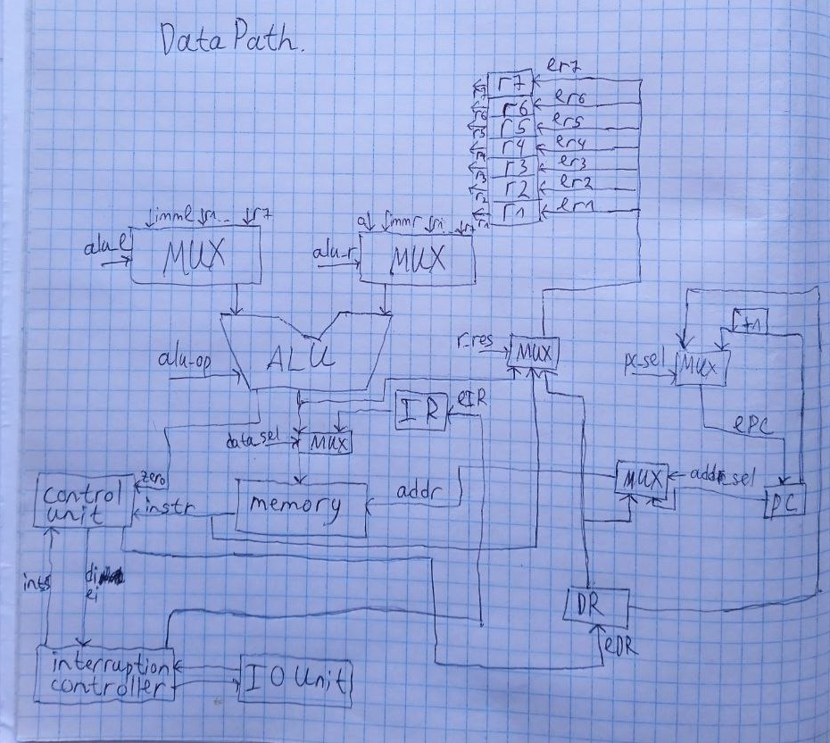
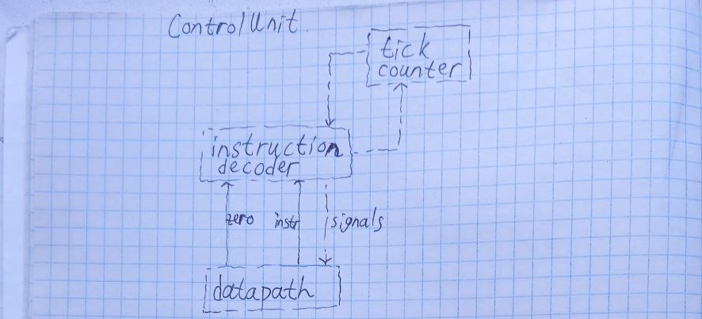

# KASM. Транслятор и модель

- Галлямов Камиль Рустемович, P3210
- `asm | risc | neum | hw | tick -> instr | struct | trap -> stream | port | pstr | prob1 | spi`
- Базовый вариант (без усложнения)

## Язык программирования

Синтаксис в расширенной БНФ.

- `[ ... ]` -- вхождение 0 или 1 раз
- `{ ... }` -- повторение 0 или несколько раз
- `{ ... }-` -- повторение 1 или несколько раз

``` ebnf
program ::= { line }

line ::= label [ comment ] "\n"
       | instr [ comment ] "\n"
       | [ comment ] "\n"

label ::= label_name ":"

instr ::= op0
        | op1 arg
        | op2 arg,arg
        | op3 arg,arg,arg

op0 ::= "input"
      | "print"
      | "halt"
      | "left"
      | "right"
      | "ei"
      | "di"
      | "iret"
      | "ret"

op1 ::= "inc"
      | "dec"
      | "jmp"
      | "print_char"
      | "call"
      
op2 ::= "jz"
      | "jnz"
      | "mov"
      | "add_str"
      | "store"
      
op3 ::= "add"
      | "sub"
      | "mod"
      | "mul"

arg ::= label_name | integer | register

register ::= "r" digit

integer ::= [ "-" ] { digit }-

digit ::= <any of "0-9">

label_name ::= <any of "a-z A-Z _"> { <any of "a-z A-Z 0-9 _"> }

comment ::= ";" <any symbols except "\n">
```

Поддерживаются однострочные комментарии, начинающиеся с `;`.

Команды:

- `inc r` -- увеличить значение в регистре r на 1
- `dec r` -- уменьшить значение в регистре r на 1
- `right` -- перейти к следующей ячейке 
- `left` -- перейти к предыдущей ячейке 
- `input` -- ввести извне значение и сохранить в текущей ячейке (символ)
- `print` -- напечатать значение из текущей ячейки (символ)

- `jmp addr` -- безусловный переход по заданному адресу или метке
- `jz addr,r` -- условный переход по заданному адресу или метке, если значение регистра r ноль
- `jnz addr,r` -- условный переход по заданному адресу или метке, если значение регистра r не ноль
- `halt` -- остановка выполнения программы
- `mov r,v` -- записать в регистр r значение v (v - это либо конкретное число, либо регистр)
- `add r,v1,v2` -- записать в регистр r значение v1 + v2 (v1, v2 - числа или регистры)
- `sub r,v1,v2` -- записать в регистр r значение v1 - v2 (v1, v2 - числа или регистры)
- `mod r,v1,v2` -- записать в регистр r значение v1 % v2 (v1, v2 - числа или регистры)
- `mul r,v1,v2` -- записать в регистр r значение v1 * v2 (v1, v2 - числа или регистры)

- `call addr` -- вызов процедуры (аргументы через регистры)
- `ret` -- завершение процедуры

- `add_str l,s` -- записать в память строку s длины l
- `print_char c` -- вывести символ из ячейки c 
- `ei` -- разрешить прерывания
- `di` -- запретить прерывания
- `iret` -- выход из обработки прерывания
- `store a,b` -- записать в ячейку a значение b

Метки для переходов определяются на отдельных строчках:

``` asm
label:
    inc r1
```

И в другом месте (неважно, до или после определения) сослаться на эту метку:

``` asm
jmp label   ; --> `jmp 123`, где 123 - номер инструкции после объявления метки
```

Транслятор поставит на место использования метки адрес той инструкции, перед которой она определена.

В программе не может быть дублирующихся меток, определенных в разных местах с одним именем.

Пример кода на Asm см. в файле [./asm/cat.asm](./asm/cat.asm).

## Организация памяти

Память соответствует фон Неймановской архитектуре.

```text
           memory
+----------------------------+
| 000 : data                 |
|            ...             | 
| 098 : data                 |
| 099 : interruption vector  |
| 100 : instruction1         |
| 101 : instruction2         |
| 102 : instruction3         |
|            ...             | 
+----------------------------+
```

Общая память для данных и инструкций, 
поэтому данные хранятся как числа, а инструкции как словари.
Вектор прерывания - это число - номер ячейки, в которой начинается обработка прерываний. 
Его записывает транслятор в зависимости от соответсвующей метки.

Есть следующие виды адресации: непосредственная, регистровая.

В связи с отсутствием на уровне языка переменных, констант, литералов и т.д., описание механизмов работы с ними -- отсутствует. Содержание раздела -- смотри в задании.

## Система команд

Особенности процессора:

- Машинное слово -- 32 бит, знаковое.
- Доступ к памяти данных осуществляется по адресу, хранящемуся в специальном регистре `data_address`. Установка адреса осуществляется путём инкрементирования или декрементирования инструкциями `<` и `>`.
- Обработка данных осуществляется по текущему адресу операциями `+` и `-`, а также через ввод/вывод.
- Поток управления:
    - инкремент `PC` после каждой инструкции;
    - условные (`jz`, `jnz`) и безусловный (`jmp`) переходы (использование см. в разделе транслятор).

### Набор инструкций

Команды языка однозначно транслируюстя в инструкции. 
Команда add_str выполняется на этапе трансляции.

| Инструкция | Кол-во тактов |
|:-----------|---------------|
| inc        | 1             |
| dec        | 1             |
| right      | 1             |
| left       | 1             |
| input      | 1             |
| print      | 1             |
| jmp        | 1             |
| jz         | 2             |
| jnz        | 2             |
| halt       | 1             |
| mov        | 1             |
| add        | 1             |
| sub        | 1             |
| mod        | 1             |
| mul        | 1             |
| call       | 2             |
| ret        | 1             |
| add_str    | 0             |
| print_char | 1             |
| ei         | 1             |
| di         | 1             |
| iret       | 1             |
| store      | 1             |

### Кодирование инструкций

- Машинный код сериализуется в список JSON.
- Один элемент списка -- одна инструкция.
- Индекс списка -- адрес инструкции. Используется для команд перехода.

Пример:

```json
[
    {
        "opcode": "jz",
        "arg": 5,
        "term": [
            1,
            5,
            "]"
        ]
    }
]
```

где:

- `opcode` -- строка с кодом операции;
- `arg` -- аргумент (может отсутствовать);
- `term` -- информация о связанном месте в исходном коде (если есть).

Типы данных в модуле [isa](./isa.py), где:

- `Opcode` -- перечисление кодов операций;
- `Term` -- структура для описания значимого фрагмента кода исходной программы.

## Транслятор

Интерфейс командной строки: `translator.py <input_file> <target_file>`

Реализован в модуле [translator](./translator.py)

Трансляция реализуется в два прохода:

1. Генерация машинного кода без адресов переходов и расчёт значений меток перехода.
    - Ассемблерные мнемоники один в один транслируются в машинные команды.
2. Подстановка меток перехода в инструкции.

## Модель процессора

Интерфейс командной строки: `machine.py <machine_code_file> <input_file>`

Реализовано в модуле: [machine](./machine.py).

### DataPath



Реализован в классе `DataPath`.

### ControlUnit



Реализован в классе `ControlUnit`.

- Hardwired (реализовано полностью на Python).
- Метод `decode_and_execute_instruction` моделирует выполнение полного цикла инструкции (1-2 такта процессора).
- `step_counter` необходим для многотактовых инструкций;
    - в реализации класс `ControlUnit` отсутствует, т.к. неявно задан потоком управления.

Основная работа с данными происходит на уровне DataPath, а ControlUnit с помощью сигналов работает с этими данными. ControlUnit реализован как hardwired.

Особенности работы модели:

- Цикл симуляции осуществляется в функции `simulation`.
- Шаг моделирования соответствует одной инструкции с выводом состояния в журнал.
- Для журнала состояний процессора используется стандартный модуль `logging`.
- Количество инструкций для моделирования лимитировано.
- Остановка моделирования осуществляется при:
    - превышении лимита количества выполняемых инструкций;
    - исключении `EOFError` -- если нет данных для чтения из порта ввода;
    - исключении `StopIteration` -- если выполнена инструкция `halt`.

## Тестирование

Тестирование выполняется при помощи golden test-ов.

Тесты для языка `asm` реализованы в: [golden_test.py](./golden_test.py). Конфигурации:

* [cat](./golden/cat.yml)
* [hello](./golden/hello.yml)
* [hello_user](./golden/hello_user.yml)
* [prob1](./golden/prob1.yml)

Запустить тесты: `poetry run pytest . -v`

Обновить конфигурацию golden tests:  `poetry run pytest . -v --update-goldens`

CI при помощи Github Action:

``` yaml
name: Python CI

on:
  push:
    branches:
      - master

jobs:
  kasm_and_processor:
    runs-on: ubuntu-latest

    steps:
    - name: Checkout code
      uses: actions/checkout@v2

    - name: Set up Python
      uses: actions/setup-python@v3
      with:
        python-version: 3.11

    - name: Install dependencies
      run: |
        python -m pip install --upgrade pip
        pip install poetry
        poetry install

    - name: Run tests and coverage
      run: |
        poetry run pytest
        poetry run coverage run -m pytest
        poetry run coverage report

    - name: Check code formatting
      run: poetry run ruff format --check .

    - name: Run code linting
      run: |
        poetry run ruff check .
```

где:

- `poetry` -- управления зависимостями для языка программирования Python.
- `coverage` -- формирование отчёта об уровне покрытия исходного кода.
- `pytest` -- утилита для запуска тестов.
- `ruff` -- утилита для форматирования и проверки стиля кодирования.

Пример использования и журнал работы процессора на примере `cat`:

``` shell
> python translator.py asm/cat.asm instructions.txt 
source LoC: 14 code instr: 9
> python machine.py instructions.txt int_input.txt
DEBUG:root:TICK:   0 PC: 100 ADDR:   0 MEM_OUT: 0 rs: 0 rc: 0 r1: 0 r2: 0 r3: 0         ei  ('ei'@1:0)
DEBUG:root:TICK:   1 PC: 101 ADDR:   0 MEM_OUT: 0 rs: 0 rc: 0 r1: 0 r2: 0 r3: 0         jmp 101  ('jmp loop'@3:0)
DEBUG:root:TICK:   2 PC: 101 ADDR:   0 MEM_OUT: 0 rs: 0 rc: 0 r1: 0 r2: 0 r3: 0         jmp 101  ('jmp loop'@3:0)
DEBUG:root:TICK:   3 PC: 101 ADDR:   0 MEM_OUT: 0 rs: 0 rc: 0 r1: 0 r2: 0 r3: 0         jmp 101  ('jmp loop'@3:0)
DEBUG:root:TICK:   4 PC: 101 ADDR:   0 MEM_OUT: 0 rs: 0 rc: 0 r1: 0 r2: 0 r3: 0         jmp 101  ('jmp loop'@3:0)
DEBUG:root:TICK:   5 PC: 101 ADDR:   0 MEM_OUT: 0 rs: 0 rc: 0 r1: 0 r2: 0 r3: 0         jmp 101  ('jmp loop'@3:0)
DEBUG:root:TICK:   6 PC: 101 ADDR:   0 MEM_OUT: 0 rs: 0 rc: 0 r1: 0 r2: 0 r3: 0         jmp 101  ('jmp loop'@3:0)
DEBUG:root:TICK:   7 PC: 101 ADDR:   0 MEM_OUT: 0 rs: 0 rc: 0 r1: 0 r2: 0 r3: 0         jmp 101  ('jmp loop'@3:0)
DEBUG:root:TICK:   8 PC: 101 ADDR:   0 MEM_OUT: 0 rs: 0 rc: 0 r1: 0 r2: 0 r3: 0         jmp 101  ('jmp loop'@3:0)
DEBUG:root:TICK:   9 PC: 101 ADDR:   0 MEM_OUT: 0 rs: 0 rc: 0 r1: 0 r2: 0 r3: 0         jmp 101  ('jmp loop'@3:0)
DEBUG:root:TICK:  10 PC: 101 ADDR:   0 MEM_OUT: 0 rs: 0 rc: 0 r1: 0 r2: 0 r3: 0         jmp 101  ('jmp loop'@3:0)
DEBUG:root:TICK:  11 PC: 101 ADDR:   0 MEM_OUT: 0 rs: 0 rc: 0 r1: 0 r2: 0 r3: 0         jmp 101  ('jmp loop'@3:0)
DEBUG:root:TICK:  12 PC: 101 ADDR:   0 MEM_OUT: 0 rs: 0 rc: 0 r1: 0 r2: 0 r3: 0         jmp 101  ('jmp loop'@3:0)
DEBUG:root:TICK:  13 PC: 101 ADDR:   0 MEM_OUT: 0 rs: 0 rc: 0 r1: 0 r2: 0 r3: 0         jmp 101  ('jmp loop'@3:0)
DEBUG:root:TICK:  14 PC: 101 ADDR:   0 MEM_OUT: 0 rs: 0 rc: 0 r1: 0 r2: 0 r3: 0         jmp 101  ('jmp loop'@3:0)
DEBUG:root:TICK:  15 PC: 101 ADDR:   0 MEM_OUT: 0 rs: 0 rc: 0 r1: 0 r2: 0 r3: 0         jmp 101  ('jmp loop'@3:0)
DEBUG:root:TICK:  16 PC: 101 ADDR:   0 MEM_OUT: 0 rs: 0 rc: 0 r1: 0 r2: 0 r3: 0         jmp 101  ('jmp loop'@3:0)
DEBUG:root:TICK:  17 PC: 101 ADDR:   0 MEM_OUT: 0 rs: 0 rc: 0 r1: 0 r2: 0 r3: 0         jmp 101  ('jmp loop'@3:0)
DEBUG:root:TICK:  18 PC: 101 ADDR:   0 MEM_OUT: 0 rs: 0 rc: 0 r1: 0 r2: 0 r3: 0         jmp 101  ('jmp loop'@3:0)
DEBUG:root:TICK:  19 PC: 101 ADDR:   0 MEM_OUT: 0 rs: 0 rc: 0 r1: 0 r2: 0 r3: 0         jmp 101  ('jmp loop'@3:0)
DEBUG:root:TICK:  20 PC: 101 ADDR:   0 MEM_OUT: 0 rs: 0 rc: 0 r1: 0 r2: 0 r3: 0         jmp 101  ('jmp loop'@3:0)
DEBUG:root:TICK:  21 PC: 101 ADDR:   0 MEM_OUT: 0 rs: 0 rc: 0 r1: 0 r2: 0 r3: 0         jmp 101  ('jmp loop'@3:0)
DEBUG:root:TICK:  22 PC: 101 ADDR:   0 MEM_OUT: 0 rs: 0 rc: 0 r1: 0 r2: 0 r3: 0         jmp 101  ('jmp loop'@3:0)
DEBUG:root:TICK:  23 PC: 101 ADDR:   0 MEM_OUT: 0 rs: 0 rc: 0 r1: 0 r2: 0 r3: 0         jmp 101  ('jmp loop'@3:0)
DEBUG:root:TICK:  24 PC: 101 ADDR:   0 MEM_OUT: 0 rs: 0 rc: 0 r1: 0 r2: 0 r3: 0         jmp 101  ('jmp loop'@3:0)
DEBUG:root:TICK:  25 PC: 101 ADDR:   0 MEM_OUT: 0 rs: 0 rc: 0 r1: 0 r2: 0 r3: 0         jmp 101  ('jmp loop'@3:0)
DEBUG:root:TICK:  26 PC: 101 ADDR:   0 MEM_OUT: 0 rs: 0 rc: 0 r1: 0 r2: 0 r3: 0         jmp 101  ('jmp loop'@3:0)
DEBUG:root:TICK:  27 PC: 101 ADDR:   0 MEM_OUT: 0 rs: 0 rc: 0 r1: 0 r2: 0 r3: 0         jmp 101  ('jmp loop'@3:0)
DEBUG:root:TICK:  28 PC: 101 ADDR:   0 MEM_OUT: 0 rs: 0 rc: 0 r1: 0 r2: 0 r3: 0         jmp 101  ('jmp loop'@3:0)
DEBUG:root:TICK:  29 PC: 101 ADDR:   0 MEM_OUT: 0 rs: 0 rc: 0 r1: 0 r2: 0 r3: 0         jmp 101  ('jmp loop'@3:0)
DEBUG:root:TICK:  30 PC: 101 ADDR:   0 MEM_OUT: 0 rs: 0 rc: 0 r1: 0 r2: 0 r3: 0         jmp 101  ('jmp loop'@3:0)
DEBUG:root:TICK:  31 PC: 101 ADDR:   0 MEM_OUT: 0 rs: 0 rc: 0 r1: 0 r2: 0 r3: 0         jmp 101  ('jmp loop'@3:0)
DEBUG:root:TICK:  32 PC: 101 ADDR:   0 MEM_OUT: 0 rs: 0 rc: 0 r1: 0 r2: 0 r3: 0         jmp 101  ('jmp loop'@3:0)
DEBUG:root:TICK:  33 PC: 101 ADDR:   0 MEM_OUT: 0 rs: 0 rc: 0 r1: 0 r2: 0 r3: 0         jmp 101  ('jmp loop'@3:0)
DEBUG:root:TICK:  34 PC: 101 ADDR:   0 MEM_OUT: 0 rs: 0 rc: 0 r1: 0 r2: 0 r3: 0         jmp 101  ('jmp loop'@3:0)
DEBUG:root:TICK:  35 PC: 101 ADDR:   0 MEM_OUT: 0 rs: 0 rc: 0 r1: 0 r2: 0 r3: 0         jmp 101  ('jmp loop'@3:0)
DEBUG:root:TICK:  36 PC: 101 ADDR:   0 MEM_OUT: 0 rs: 0 rc: 0 r1: 0 r2: 0 r3: 0         jmp 101  ('jmp loop'@3:0)
DEBUG:root:TICK:  37 PC: 101 ADDR:   0 MEM_OUT: 0 rs: 0 rc: 0 r1: 0 r2: 0 r3: 0         jmp 101  ('jmp loop'@3:0)
DEBUG:root:TICK:  38 PC: 101 ADDR:   0 MEM_OUT: 0 rs: 0 rc: 0 r1: 0 r2: 0 r3: 0         jmp 101  ('jmp loop'@3:0)
DEBUG:root:TICK:  39 PC: 101 ADDR:   0 MEM_OUT: 0 rs: 0 rc: 0 r1: 0 r2: 0 r3: 0         jmp 101  ('jmp loop'@3:0)
DEBUG:root:TICK:  40 PC: 101 ADDR:   0 MEM_OUT: 0 rs: 0 rc: 0 r1: 0 r2: 0 r3: 0         jmp 101  ('jmp loop'@3:0)
DEBUG:root:TICK:  41 PC: 101 ADDR:   0 MEM_OUT: 0 rs: 0 rc: 0 r1: 0 r2: 0 r3: 0         jmp 101  ('jmp loop'@3:0)
DEBUG:root:TICK:  42 PC: 101 ADDR:   0 MEM_OUT: 0 rs: 0 rc: 0 r1: 0 r2: 0 r3: 0         jmp 101  ('jmp loop'@3:0)
DEBUG:root:TICK:  43 PC: 101 ADDR:   0 MEM_OUT: 0 rs: 0 rc: 0 r1: 0 r2: 0 r3: 0         jmp 101  ('jmp loop'@3:0)
DEBUG:root:TICK:  44 PC: 101 ADDR:   0 MEM_OUT: 0 rs: 0 rc: 0 r1: 0 r2: 0 r3: 0         jmp 101  ('jmp loop'@3:0)
DEBUG:root:TICK:  45 PC: 101 ADDR:   0 MEM_OUT: 0 rs: 0 rc: 0 r1: 0 r2: 0 r3: 0         jmp 101  ('jmp loop'@3:0)
DEBUG:root:TICK:  46 PC: 101 ADDR:   0 MEM_OUT: 0 rs: 0 rc: 0 r1: 0 r2: 0 r3: 0         jmp 101  ('jmp loop'@3:0)
DEBUG:root:TICK:  47 PC: 101 ADDR:   0 MEM_OUT: 0 rs: 0 rc: 0 r1: 0 r2: 0 r3: 0         jmp 101  ('jmp loop'@3:0)
DEBUG:root:TICK:  48 PC: 101 ADDR:   0 MEM_OUT: 0 rs: 0 rc: 0 r1: 0 r2: 0 r3: 0         jmp 101  ('jmp loop'@3:0)
DEBUG:root:TICK:  49 PC: 101 ADDR:   0 MEM_OUT: 0 rs: 0 rc: 0 r1: 0 r2: 0 r3: 0         jmp 101  ('jmp loop'@3:0)
DEBUG:root:TICK:  50 PC: 101 ADDR:   0 MEM_OUT: 0 rs: 0 rc: 0 r1: 0 r2: 0 r3: 0         jmp 101  ('jmp loop'@3:0)
DEBUG:root:TICK:  51 PC: 101 ADDR:   0 MEM_OUT: 0 rs: 0 rc: 0 r1: 0 r2: 0 r3: 0         jmp 101  ('jmp loop'@3:0)
DEBUG:root:TICK:  52 PC: 101 ADDR:   0 MEM_OUT: 0 rs: 0 rc: 0 r1: 0 r2: 0 r3: 0         jmp 101  ('jmp loop'@3:0)
DEBUG:root:TICK:  53 PC: 101 ADDR:   0 MEM_OUT: 0 rs: 0 rc: 0 r1: 0 r2: 0 r3: 0         jmp 101  ('jmp loop'@3:0)
DEBUG:root:TICK:  54 PC: 101 ADDR:   0 MEM_OUT: 0 rs: 0 rc: 0 r1: 0 r2: 0 r3: 0         jmp 101  ('jmp loop'@3:0)
DEBUG:root:TICK:  55 PC: 101 ADDR:   0 MEM_OUT: 0 rs: 0 rc: 0 r1: 0 r2: 0 r3: 0         jmp 101  ('jmp loop'@3:0)
DEBUG:root:TICK:  56 PC: 101 ADDR:   0 MEM_OUT: 0 rs: 0 rc: 0 r1: 0 r2: 0 r3: 0         jmp 101  ('jmp loop'@3:0)
DEBUG:root:TICK:  57 PC: 101 ADDR:   0 MEM_OUT: 0 rs: 0 rc: 0 r1: 0 r2: 0 r3: 0         jmp 101  ('jmp loop'@3:0)
DEBUG:root:TICK:  58 PC: 101 ADDR:   0 MEM_OUT: 0 rs: 0 rc: 0 r1: 0 r2: 0 r3: 0         jmp 101  ('jmp loop'@3:0)
DEBUG:root:TICK:  59 PC: 101 ADDR:   0 MEM_OUT: 0 rs: 0 rc: 0 r1: 0 r2: 0 r3: 0         jmp 101  ('jmp loop'@3:0)
DEBUG:root:TICK:  60 PC: 101 ADDR:   0 MEM_OUT: 0 rs: 0 rc: 0 r1: 0 r2: 0 r3: 0         jmp 101  ('jmp loop'@3:0)
DEBUG:root:TICK:  61 PC: 101 ADDR:   0 MEM_OUT: 0 rs: 0 rc: 0 r1: 0 r2: 0 r3: 0         jmp 101  ('jmp loop'@3:0)
DEBUG:root:TICK:  62 PC: 101 ADDR:   0 MEM_OUT: 0 rs: 0 rc: 0 r1: 0 r2: 0 r3: 0         jmp 101  ('jmp loop'@3:0)
DEBUG:root:TICK:  63 PC: 101 ADDR:   0 MEM_OUT: 0 rs: 0 rc: 0 r1: 0 r2: 0 r3: 0         jmp 101  ('jmp loop'@3:0)
DEBUG:root:TICK:  64 PC: 101 ADDR:   0 MEM_OUT: 0 rs: 0 rc: 0 r1: 0 r2: 0 r3: 0         jmp 101  ('jmp loop'@3:0)
DEBUG:root:TICK:  65 PC: 101 ADDR:   0 MEM_OUT: 0 rs: 0 rc: 0 r1: 0 r2: 0 r3: 0         jmp 101  ('jmp loop'@3:0)
DEBUG:root:TICK:  66 PC: 101 ADDR:   0 MEM_OUT: 0 rs: 0 rc: 0 r1: 0 r2: 0 r3: 0         jmp 101  ('jmp loop'@3:0)
DEBUG:root:TICK:  67 PC: 101 ADDR:   0 MEM_OUT: 0 rs: 0 rc: 0 r1: 0 r2: 0 r3: 0         jmp 101  ('jmp loop'@3:0)
DEBUG:root:TICK:  68 PC: 101 ADDR:   0 MEM_OUT: 0 rs: 0 rc: 0 r1: 0 r2: 0 r3: 0         jmp 101  ('jmp loop'@3:0)
DEBUG:root:TICK:  69 PC: 101 ADDR:   0 MEM_OUT: 0 rs: 0 rc: 0 r1: 0 r2: 0 r3: 0         jmp 101  ('jmp loop'@3:0)
DEBUG:root:TICK:  70 PC: 101 ADDR:   0 MEM_OUT: 0 rs: 0 rc: 0 r1: 0 r2: 0 r3: 0         jmp 101  ('jmp loop'@3:0)
DEBUG:root:TICK:  71 PC: 101 ADDR:   0 MEM_OUT: 0 rs: 0 rc: 0 r1: 0 r2: 0 r3: 0         jmp 101  ('jmp loop'@3:0)
DEBUG:root:START HANDLING INTERRUPTION
DEBUG:root:TICK:  72 PC: 103 ADDR:   0 MEM_OUT: 0 rs: 0 rc: 0 r1: 0 r2: 0 r3: 0         input  ('input'@7:0)
DEBUG:root:input: 'K'
DEBUG:root:TICK:  73 PC: 104 ADDR:   0 MEM_OUT: 75 rs: 0 rc: 0 r1: 0 r2: 0 r3: 0        jz [108, 'ir']  ('jz break,ir'@8:0)
DEBUG:root:TICK:  74 PC: 104 ADDR:   0 MEM_OUT: 75 rs: 0 rc: 0 r1: 0 r2: 0 r3: 0        jz [108, 'ir']  ('jz break,ir'@8:0)
DEBUG:root:TICK:  75 PC: 105 ADDR:   0 MEM_OUT: 75 rs: 0 rc: 0 r1: 0 r2: 0 r3: 0        print  ('print'@9:0)
DEBUG:root:TICK:  76 PC: 105 ADDR:   0 MEM_OUT: 75 rs: 0 rc: 0 r1: 0 r2: 0 r3: 0        print  ('print'@9:0)
DEBUG:root:output: '' << 'K'
DEBUG:root:TICK:  77 PC: 106 ADDR:   0 MEM_OUT: 75 rs: 0 rc: 0 r1: 0 r2: 0 r3: 0        ei  ('ei'@10:0)
DEBUG:root:TICK:  78 PC: 107 ADDR:   0 MEM_OUT: 75 rs: 0 rc: 0 r1: 0 r2: 0 r3: 0        iret  ('iret'@11:0)
DEBUG:root:STOP HANDLING INTERRUPTION
DEBUG:root:TICK:  79 PC: 101 ADDR:   0 MEM_OUT: 75 rs: 0 rc: 0 r1: 0 r2: 0 r3: 0        jmp 101  ('jmp loop'@3:0)
DEBUG:root:TICK:  80 PC: 101 ADDR:   0 MEM_OUT: 75 rs: 0 rc: 0 r1: 0 r2: 0 r3: 0        jmp 101  ('jmp loop'@3:0)
DEBUG:root:TICK:  81 PC: 101 ADDR:   0 MEM_OUT: 75 rs: 0 rc: 0 r1: 0 r2: 0 r3: 0        jmp 101  ('jmp loop'@3:0)
DEBUG:root:START HANDLING INTERRUPTION
DEBUG:root:TICK:  82 PC: 103 ADDR:   0 MEM_OUT: 75 rs: 0 rc: 0 r1: 0 r2: 0 r3: 0        input  ('input'@7:0)
DEBUG:root:input: 'A'
DEBUG:root:TICK:  83 PC: 104 ADDR:   0 MEM_OUT: 65 rs: 0 rc: 0 r1: 0 r2: 0 r3: 0        jz [108, 'ir']  ('jz break,ir'@8:0)
DEBUG:root:TICK:  84 PC: 104 ADDR:   0 MEM_OUT: 65 rs: 0 rc: 0 r1: 0 r2: 0 r3: 0        jz [108, 'ir']  ('jz break,ir'@8:0)
DEBUG:root:TICK:  85 PC: 105 ADDR:   0 MEM_OUT: 65 rs: 0 rc: 0 r1: 0 r2: 0 r3: 0        print  ('print'@9:0)
DEBUG:root:TICK:  86 PC: 105 ADDR:   0 MEM_OUT: 65 rs: 0 rc: 0 r1: 0 r2: 0 r3: 0        print  ('print'@9:0)
DEBUG:root:output: 'K' << 'A'
DEBUG:root:TICK:  87 PC: 106 ADDR:   0 MEM_OUT: 65 rs: 0 rc: 0 r1: 0 r2: 0 r3: 0        ei  ('ei'@10:0)
DEBUG:root:TICK:  88 PC: 107 ADDR:   0 MEM_OUT: 65 rs: 0 rc: 0 r1: 0 r2: 0 r3: 0        iret  ('iret'@11:0)
DEBUG:root:STOP HANDLING INTERRUPTION
DEBUG:root:TICK:  89 PC: 101 ADDR:   0 MEM_OUT: 65 rs: 0 rc: 0 r1: 0 r2: 0 r3: 0        jmp 101  ('jmp loop'@3:0)
DEBUG:root:TICK:  90 PC: 101 ADDR:   0 MEM_OUT: 65 rs: 0 rc: 0 r1: 0 r2: 0 r3: 0        jmp 101  ('jmp loop'@3:0)
DEBUG:root:TICK:  91 PC: 101 ADDR:   0 MEM_OUT: 65 rs: 0 rc: 0 r1: 0 r2: 0 r3: 0        jmp 101  ('jmp loop'@3:0)
DEBUG:root:START HANDLING INTERRUPTION
DEBUG:root:TICK:  92 PC: 103 ADDR:   0 MEM_OUT: 65 rs: 0 rc: 0 r1: 0 r2: 0 r3: 0        input  ('input'@7:0)
DEBUG:root:input: 'M'
DEBUG:root:TICK:  93 PC: 104 ADDR:   0 MEM_OUT: 77 rs: 0 rc: 0 r1: 0 r2: 0 r3: 0        jz [108, 'ir']  ('jz break,ir'@8:0)
DEBUG:root:TICK:  94 PC: 104 ADDR:   0 MEM_OUT: 77 rs: 0 rc: 0 r1: 0 r2: 0 r3: 0        jz [108, 'ir']  ('jz break,ir'@8:0)
DEBUG:root:TICK:  95 PC: 105 ADDR:   0 MEM_OUT: 77 rs: 0 rc: 0 r1: 0 r2: 0 r3: 0        print  ('print'@9:0)
DEBUG:root:TICK:  96 PC: 105 ADDR:   0 MEM_OUT: 77 rs: 0 rc: 0 r1: 0 r2: 0 r3: 0        print  ('print'@9:0)
DEBUG:root:output: 'KA' << 'M'
DEBUG:root:TICK:  97 PC: 106 ADDR:   0 MEM_OUT: 77 rs: 0 rc: 0 r1: 0 r2: 0 r3: 0        ei  ('ei'@10:0)
DEBUG:root:TICK:  98 PC: 107 ADDR:   0 MEM_OUT: 77 rs: 0 rc: 0 r1: 0 r2: 0 r3: 0        iret  ('iret'@11:0)
DEBUG:root:STOP HANDLING INTERRUPTION
DEBUG:root:TICK:  99 PC: 101 ADDR:   0 MEM_OUT: 77 rs: 0 rc: 0 r1: 0 r2: 0 r3: 0        jmp 101  ('jmp loop'@3:0)
DEBUG:root:TICK: 100 PC: 101 ADDR:   0 MEM_OUT: 77 rs: 0 rc: 0 r1: 0 r2: 0 r3: 0        jmp 101  ('jmp loop'@3:0)
DEBUG:root:TICK: 101 PC: 101 ADDR:   0 MEM_OUT: 77 rs: 0 rc: 0 r1: 0 r2: 0 r3: 0        jmp 101  ('jmp loop'@3:0)
DEBUG:root:START HANDLING INTERRUPTION
DEBUG:root:TICK: 102 PC: 103 ADDR:   0 MEM_OUT: 77 rs: 0 rc: 0 r1: 0 r2: 0 r3: 0        input  ('input'@7:0)
DEBUG:root:input: 'I'
DEBUG:root:TICK: 103 PC: 104 ADDR:   0 MEM_OUT: 73 rs: 0 rc: 0 r1: 0 r2: 0 r3: 0        jz [108, 'ir']  ('jz break,ir'@8:0)
DEBUG:root:TICK: 104 PC: 104 ADDR:   0 MEM_OUT: 73 rs: 0 rc: 0 r1: 0 r2: 0 r3: 0        jz [108, 'ir']  ('jz break,ir'@8:0)
DEBUG:root:TICK: 105 PC: 105 ADDR:   0 MEM_OUT: 73 rs: 0 rc: 0 r1: 0 r2: 0 r3: 0        print  ('print'@9:0)
DEBUG:root:TICK: 106 PC: 105 ADDR:   0 MEM_OUT: 73 rs: 0 rc: 0 r1: 0 r2: 0 r3: 0        print  ('print'@9:0)
DEBUG:root:output: 'KAM' << 'I'
DEBUG:root:TICK: 107 PC: 106 ADDR:   0 MEM_OUT: 73 rs: 0 rc: 0 r1: 0 r2: 0 r3: 0        ei  ('ei'@10:0)
DEBUG:root:TICK: 108 PC: 107 ADDR:   0 MEM_OUT: 73 rs: 0 rc: 0 r1: 0 r2: 0 r3: 0        iret  ('iret'@11:0)
DEBUG:root:STOP HANDLING INTERRUPTION
DEBUG:root:TICK: 109 PC: 101 ADDR:   0 MEM_OUT: 73 rs: 0 rc: 0 r1: 0 r2: 0 r3: 0        jmp 101  ('jmp loop'@3:0)
DEBUG:root:TICK: 110 PC: 101 ADDR:   0 MEM_OUT: 73 rs: 0 rc: 0 r1: 0 r2: 0 r3: 0        jmp 101  ('jmp loop'@3:0)
DEBUG:root:TICK: 111 PC: 101 ADDR:   0 MEM_OUT: 73 rs: 0 rc: 0 r1: 0 r2: 0 r3: 0        jmp 101  ('jmp loop'@3:0)
DEBUG:root:START HANDLING INTERRUPTION
DEBUG:root:TICK: 112 PC: 103 ADDR:   0 MEM_OUT: 73 rs: 0 rc: 0 r1: 0 r2: 0 r3: 0        input  ('input'@7:0)
DEBUG:root:input: 'L'
DEBUG:root:TICK: 113 PC: 104 ADDR:   0 MEM_OUT: 76 rs: 0 rc: 0 r1: 0 r2: 0 r3: 0        jz [108, 'ir']  ('jz break,ir'@8:0)
DEBUG:root:TICK: 114 PC: 104 ADDR:   0 MEM_OUT: 76 rs: 0 rc: 0 r1: 0 r2: 0 r3: 0        jz [108, 'ir']  ('jz break,ir'@8:0)
DEBUG:root:TICK: 115 PC: 105 ADDR:   0 MEM_OUT: 76 rs: 0 rc: 0 r1: 0 r2: 0 r3: 0        print  ('print'@9:0)
DEBUG:root:TICK: 116 PC: 105 ADDR:   0 MEM_OUT: 76 rs: 0 rc: 0 r1: 0 r2: 0 r3: 0        print  ('print'@9:0)
DEBUG:root:output: 'KAMI' << 'L'
DEBUG:root:TICK: 117 PC: 106 ADDR:   0 MEM_OUT: 76 rs: 0 rc: 0 r1: 0 r2: 0 r3: 0        ei  ('ei'@10:0)
DEBUG:root:TICK: 118 PC: 107 ADDR:   0 MEM_OUT: 76 rs: 0 rc: 0 r1: 0 r2: 0 r3: 0        iret  ('iret'@11:0)
DEBUG:root:STOP HANDLING INTERRUPTION
DEBUG:root:TICK: 119 PC: 101 ADDR:   0 MEM_OUT: 76 rs: 0 rc: 0 r1: 0 r2: 0 r3: 0        jmp 101  ('jmp loop'@3:0)
DEBUG:root:TICK: 120 PC: 101 ADDR:   0 MEM_OUT: 76 rs: 0 rc: 0 r1: 0 r2: 0 r3: 0        jmp 101  ('jmp loop'@3:0)
DEBUG:root:TICK: 121 PC: 101 ADDR:   0 MEM_OUT: 76 rs: 0 rc: 0 r1: 0 r2: 0 r3: 0        jmp 101  ('jmp loop'@3:0)
DEBUG:root:START HANDLING INTERRUPTION
DEBUG:root:TICK: 122 PC: 103 ADDR:   0 MEM_OUT: 76 rs: 0 rc: 0 r1: 0 r2: 0 r3: 0        input  ('input'@7:0)
DEBUG:root:input: '4'
DEBUG:root:TICK: 123 PC: 104 ADDR:   0 MEM_OUT: 52 rs: 0 rc: 0 r1: 0 r2: 0 r3: 0        jz [108, 'ir']  ('jz break,ir'@8:0)
DEBUG:root:TICK: 124 PC: 104 ADDR:   0 MEM_OUT: 52 rs: 0 rc: 0 r1: 0 r2: 0 r3: 0        jz [108, 'ir']  ('jz break,ir'@8:0)
DEBUG:root:TICK: 125 PC: 105 ADDR:   0 MEM_OUT: 52 rs: 0 rc: 0 r1: 0 r2: 0 r3: 0        print  ('print'@9:0)
DEBUG:root:TICK: 126 PC: 105 ADDR:   0 MEM_OUT: 52 rs: 0 rc: 0 r1: 0 r2: 0 r3: 0        print  ('print'@9:0)
DEBUG:root:output: 'KAMIL' << '4'
DEBUG:root:TICK: 127 PC: 106 ADDR:   0 MEM_OUT: 52 rs: 0 rc: 0 r1: 0 r2: 0 r3: 0        ei  ('ei'@10:0)
DEBUG:root:TICK: 128 PC: 107 ADDR:   0 MEM_OUT: 52 rs: 0 rc: 0 r1: 0 r2: 0 r3: 0        iret  ('iret'@11:0)
DEBUG:root:STOP HANDLING INTERRUPTION
DEBUG:root:TICK: 129 PC: 101 ADDR:   0 MEM_OUT: 52 rs: 0 rc: 0 r1: 0 r2: 0 r3: 0        jmp 101  ('jmp loop'@3:0)
DEBUG:root:TICK: 130 PC: 101 ADDR:   0 MEM_OUT: 52 rs: 0 rc: 0 r1: 0 r2: 0 r3: 0        jmp 101  ('jmp loop'@3:0)
DEBUG:root:TICK: 131 PC: 101 ADDR:   0 MEM_OUT: 52 rs: 0 rc: 0 r1: 0 r2: 0 r3: 0        jmp 101  ('jmp loop'@3:0)
DEBUG:root:START HANDLING INTERRUPTION
DEBUG:root:TICK: 132 PC: 103 ADDR:   0 MEM_OUT: 52 rs: 0 rc: 0 r1: 0 r2: 0 r3: 0        input  ('input'@7:0)
DEBUG:root:input: 'i'
DEBUG:root:TICK: 133 PC: 104 ADDR:   0 MEM_OUT: 105 rs: 0 rc: 0 r1: 0 r2: 0 r3: 0       jz [108, 'ir']  ('jz break,ir'@8:0)
DEBUG:root:TICK: 134 PC: 104 ADDR:   0 MEM_OUT: 105 rs: 0 rc: 0 r1: 0 r2: 0 r3: 0       jz [108, 'ir']  ('jz break,ir'@8:0)
DEBUG:root:TICK: 135 PC: 105 ADDR:   0 MEM_OUT: 105 rs: 0 rc: 0 r1: 0 r2: 0 r3: 0       print  ('print'@9:0)
DEBUG:root:TICK: 136 PC: 105 ADDR:   0 MEM_OUT: 105 rs: 0 rc: 0 r1: 0 r2: 0 r3: 0       print  ('print'@9:0)
DEBUG:root:output: 'KAMIL4' << 'i'
DEBUG:root:TICK: 137 PC: 106 ADDR:   0 MEM_OUT: 105 rs: 0 rc: 0 r1: 0 r2: 0 r3: 0       ei  ('ei'@10:0)
DEBUG:root:TICK: 138 PC: 107 ADDR:   0 MEM_OUT: 105 rs: 0 rc: 0 r1: 0 r2: 0 r3: 0       iret  ('iret'@11:0)
DEBUG:root:STOP HANDLING INTERRUPTION
DEBUG:root:TICK: 139 PC: 101 ADDR:   0 MEM_OUT: 105 rs: 0 rc: 0 r1: 0 r2: 0 r3: 0       jmp 101  ('jmp loop'@3:0)
DEBUG:root:TICK: 140 PC: 101 ADDR:   0 MEM_OUT: 105 rs: 0 rc: 0 r1: 0 r2: 0 r3: 0       jmp 101  ('jmp loop'@3:0)
DEBUG:root:TICK: 141 PC: 101 ADDR:   0 MEM_OUT: 105 rs: 0 rc: 0 r1: 0 r2: 0 r3: 0       jmp 101  ('jmp loop'@3:0)
DEBUG:root:START HANDLING INTERRUPTION
DEBUG:root:TICK: 142 PC: 103 ADDR:   0 MEM_OUT: 105 rs: 0 rc: 0 r1: 0 r2: 0 r3: 0       input  ('input'@7:0)
DEBUG:root:input: 'k'
DEBUG:root:TICK: 143 PC: 104 ADDR:   0 MEM_OUT: 107 rs: 0 rc: 0 r1: 0 r2: 0 r3: 0       jz [108, 'ir']  ('jz break,ir'@8:0)
DEBUG:root:TICK: 152 PC: 103 ADDR:   0 MEM_OUT: 107 rs: 0 rc: 0 r1: 0 r2: 0 r3: 0       input  ('input'@7:0)
DEBUG:root:input: '\x00'
DEBUG:root:TICK: 153 PC: 104 ADDR:   0 MEM_OUT: 0 rs: 0 rc: 0 r1: 0 r2: 0 r3: 0         jz [108, 'ir']  ('jz break,ir'@8:0)
DEBUG:root:TICK: 154 PC: 104 ADDR:   0 MEM_OUT: 0 rs: 0 rc: 0 r1: 0 r2: 0 r3: 0         jz [108, 'ir']  ('jz break,ir'@8:0)
DEBUG:root:TICK: 155 PC: 108 ADDR:   0 MEM_OUT: 0 rs: 0 rc: 0 r1: 0 r2: 0 r3: 0         halt  ('halt'@14:0)
INFO:root:output_buffer: 'KAMIL4ik'
KAMIL4ik
instr_counter:  138 ticks: 155
```

Пример проверки исходного кода:

``` shell
poetry run pytest . -v
============================================================== test session starts ===============================================================
platform win32 -- Python 3.11.4, pytest-7.4.4, pluggy-1.5.0 -- C:\Users\kamil\AppData\Local\pypoetry\Cache\virtualenvs\asm-Gv7gZYCv-py3.11\Scripts\python.exe
cachedir: .pytest_cache
rootdir: D:\itmo\web\test\csa\asm
configfile: pyproject.toml
plugins: golden-0.2.2
collected 4 items                                                                                                                                 

golden_test.py::test_translator_asm_and_machine[golden/cat.yml] PASSED                                                                      [ 25%]
golden_test.py::test_translator_asm_and_machine[golden/hello.yml] PASSED                                                                    [ 50%]
golden_test.py::test_translator_asm_and_machine[golden/hello_user.yml] PASSED                                                               [ 75%]
golden_test.py::test_translator_asm_and_machine[golden/prob1.yml] PASSED                                                                    [100%]

=============================================================== 4 passed in 2.18s ================================================================ 
poetry run ruff check .
```

```text
| ФИО                         | алг        | LoC | code инстр. | инстр. | такт. |
| Галлямов Камиль Рустемович  | cat        | 14  | 9           | 138    | 155   |
| Галлямов Камиль Рустемович  | hello      | 17  | 10          | 65     | 78    |
| Галлямов Камиль Рустемович  | hello_user | 53  | 31          | 254    | 301   |
| Галлямов Камиль Рустемович  | prob1      | 21  | 11          | 7462   | 9461  |
```